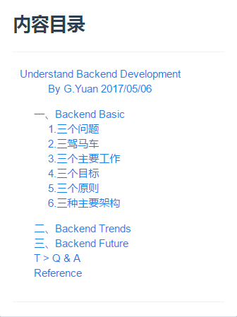
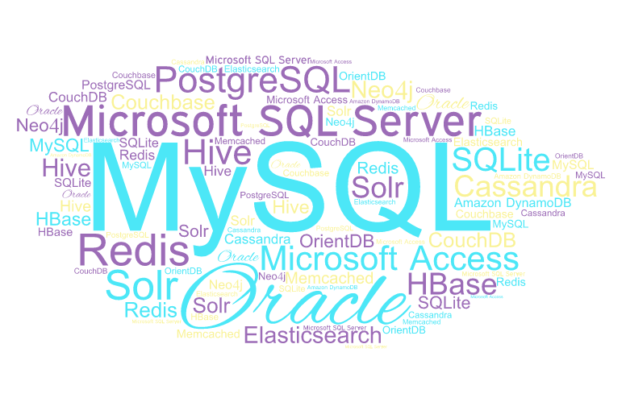
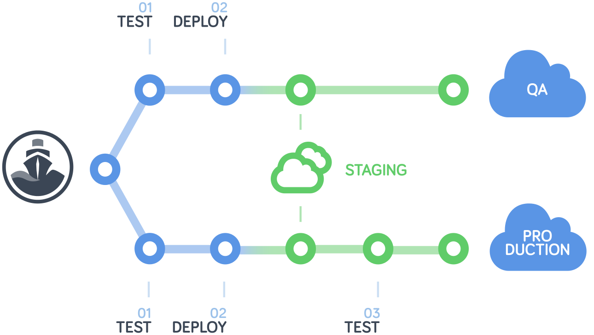
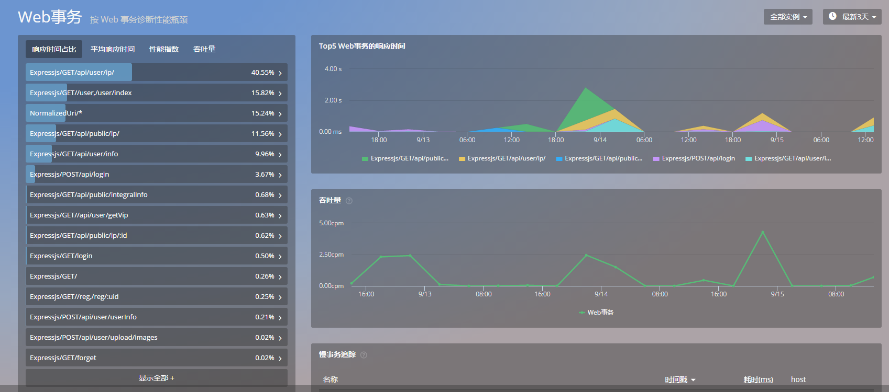
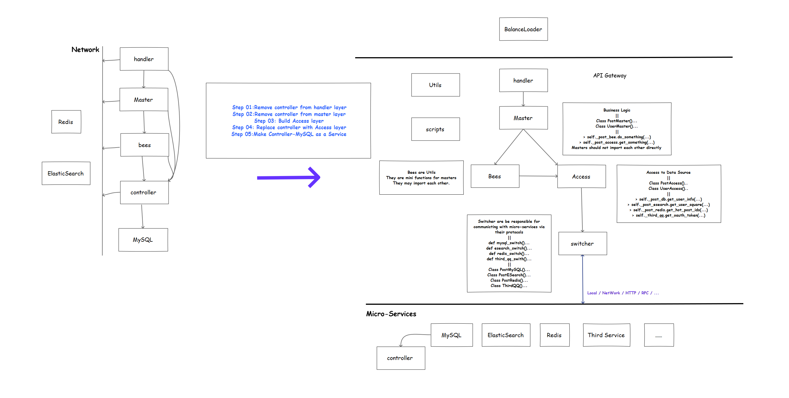

# <center>Understand Backend Development</center>

## <center>后端协会半小时从入门到放弃全教程</center>

### <center> By G.Yuan 2017/05/06</center>





## 一、Backend Basic

### 1.三个问题
        Q1: 数据如何存储？
	        a.txt b.cvs c.xls
	        MySQL MongoDB Redis Neo4j Elasticsearch

			> 数据库本质上只是一种优化过的文件格式，配合数据库软件提供的存储引擎进行高效率的读写操作

        Q2: 数据如何获取？
	        open and read file directly
	        open and read database directly
	        access data with orm

        Q3: 数据如何返回？
	        XML/HTML/JSON/Protocol Buffer/Self-Design-Protocol/...


### 2.三驾马车



        H1: Database 数据库
	        Relational/NoSQL/Mixed

        H2: Database Access Middleware 数据库访问中间件
	        (1).ORM(Object Relation Model)
			(2).JDBC or ODBC 等原生驱动

        H3: Network Service Development Framework 网络开发框架
	        RESTful/RPC/MessageQueue/Self-Design-Protocol/...

REALWORLD STACK

        (1).Python
	        Tornado/Flask/Django/falcon + SQLAlchemy + MySQL/Redis/MongoDB

	    (2).Java
		    Spring + Hibernate + MySQL/Redis/MongoDB

		(3).Swift
			Perfect + Fluent + MySQL/Redis/MongoDB

		(4).Go
			beego + xorm + MySQL/Redis/MongoDB

### 3.三个主要工作
        W1: Coding 编码

        W2: Deployment 部署

        W3: Monitoring 监控



<center> Deployment </center>



 <center>Monitoring</center>


### 4.三个目标
        G1: 高可用
           24 * 365 小时，全年不间断提供服务

        G2: 可扩展
            十分方便、安全地在现有体系中添加新业务、新服务

        G3: 易伸缩
            可根据流量峰值属性便捷地增加或减少机器保证服务正常运转


### 5.三个原则
        R1: 架构原则
            麻雀虽小，五脏俱全

        R2: 编码原则
            没有代码就没有维护，也没有BUG

        R3: 重构原则
            少胜于多，美胜于丑


### 6.三种主要架构

        A1: Monolithic Architecture
            单体应用架构：数据库、中间件、网络框架等所有代码，各种功能全部由一个服务包装，部署在同一台服务器上

        A2: SOA(Service Oriented Architecture)
            面向服务的架构：粗粒度，松耦合，少量的无状态的服务

        A3: Microservice Architecture
            微服务架构：细粒度，松耦合，大量的无状态的、数据库独立的微服务



 <center>第一弹APP后端架构</center>


## 二、Backend Trends

        T1: 大规模分布式云计算基础设施

        T2: 企业级微服务架构

        T3: 大数据处理技术

        T4: 机器学习方法

        T5: 人工智能应用


## 三、Backend Future

        F1: 通用量子计算机 Universal Quantum Computer

        F2: 超高速大规模非易失性RAM

        F3: Unikernel Service


 

### <center>通用量子计算机与超高速大规模非易失性RAM 如何加速开发</center>


##<center> T  >  Q & A  </center>
	# WHY PYTHON?
	#
	#
	#
	#
	#
	#
	#
	# 软件是什么？


## Reference

```
	1.《大型网站技术架构：核心原理与案例分析》 李智慧 著

	2.微服务实战1-7系列博客
	  http://dockone.io/article/394

	3.机器学习驱动编程：新世界的新编程
	  http://www.infoq.com/cn/articles/machine-learning-programing

	4.Unikernels: Beyond Containers to the Next Generation of Cloud.pdf
	  http://www.oreilly.com/webops-perf/free/unikernels.csp

```


